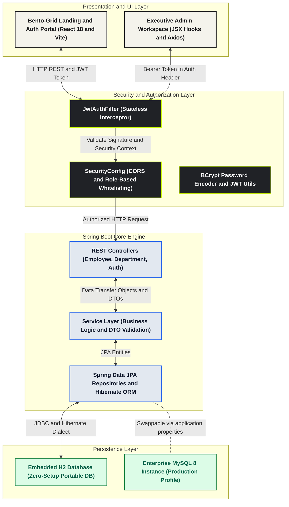

# SmartEMS - Enterprise Decoupled Employee Management Platform
### Full-Stack Java · Spring Boot 3 · React 18 (Vite) Modular UI · CORS + Stateless JWT · H2/MySQL · OpenAPI Swagger

---

## 🌟 Project Highlights for Recruiters & Hiring Managers
This enterprise-grade application demonstrates a clean, scalable, and beautifully architected **Java Full Stack** system built to enterprise production standards:
1. **Decoupled Frontend UI Architecture:** Inspired by modern SaaS platforms (Tabela), built with **React 18 (Vite) & Bootstrap 5** featuring modular JSX components, stateful hooks (`useState`, `useEffect`, `useCallback`), an interactive Bento Box Grid landing page, a split-screen luxury authentication portal, dynamic employee avatars, and real-time dashboard sync beacons.
2. **Backend Engine:** Built with **Spring Boot 3 (Java 17 LTS)** adhering strictly to separation-of-concerns layered patterns (Controller → Service → Repository → Database).
3. **Enterprise Security Suite:** 100% stateless role-based authorization (`ROLE_ADMIN` & `ROLE_EMPLOYEE`) protected by JSON Web Tokens (JWT), BCrypt password encryption, and enterprise CORS (Cross-Origin Resource Sharing) filter configurations.
4. **Zero-Setup Portability & Dual Execution Modes:** Includes both an independent React development workspace (`frontend/`) for live decoupled hot-reloading AND pre-compiled React bundles hosted natively inside Spring Boot (`src/main/resources/static/`). Reviewers and interviewers can launch the entire application instantly from a single Java command on an embedded **H2 File Database** without installing MySQL or configuring complex local infrastructure.

---

## 📸 Executive UI Showcase & Visual Snapshots

### 1. Tabela-Style Bento-Grid Landing Page
*Features warm rounded cream container styling, hand-drawn lime highlight marker, interactive workforce live preview cards, and one-click demo launchpads.*


### 2. Luxury Split-Screen Authentication Portal (Sign In & Register)
*Features high-contrast charcoal security side-panel with simulated real-time 256-bit JWT encryption terminal output and interactive employee avatar stacks.*


### 3. After-Login Executive Workforce Admin Dashboard
*Features pulsing live sync indicator, automated administrator avatar profiles, 4 high-impact Bento KPI metric cards, and avatar-enriched workforce data tables with workplace status tags (Onsite Active, Remote Sync, Hybrid Flex).*


---

## 🏛️ System Architecture & Data Flow Diagram

The application leverages a decoupled frontend-backend architecture engineered within a unified enterprise Spring Boot infrastructure. All HTTP interactions are stateless and authenticated via Axios JWT Authorization header interception.



---

## 🚀 Quick Launch & Dual Execution Modes

### Option 1: Zero-Setup Single Command (Recommended for Reviewers)
Because the React production bundles are pre-compiled into Spring Boot's resource directory, simply open your terminal at the root project folder and run:
```powershell
.\mvnw.cmd clean spring-boot:run
```
*(On Linux/macOS run `./mvnw clean spring-boot:run`)*  
Access the full platform instantly at: **http://localhost:8080/**

### Option 2: Full Decoupled Enterprise Dev Environment (React Vite + Spring Boot)
When developing or evaluating the standalone React JSX component tree:
1. Keep Spring Boot server running on port `8080` (handles backend REST APIs and database).
2. Open a second terminal inside the `frontend/` directory and execute:
```powershell
cd frontend
npm install
npm run dev
```
3. Access the lightning-fast Vite Hot-Reload development server at: **http://localhost:5173/** (with automated API proxying to Spring Boot).

---

## 🌐 Application Entry Points & Navigation

Once the server begins executing, select your destination:

| Portal Destination | URL Link | Description |
| :--- | :--- | :--- |
| **🎨 Main Web Workspace** | **http://localhost:8080/** or **http://localhost:5173/** | **Primary Entry Point: React 18 Modular SPA (Bento Landing + Executive Workspace)** |
| **📚 Backend API Docs** | **http://localhost:8080/swagger-ui.html** | Automated OpenAPI 3 / Swagger interactive REST endpoint playground |
| **🗄️ Database Console** | **http://localhost:8080/h2-console** | Embedded H2 JDBC web inspector (JDBC URL: `jdbc:h2:file:./data/ems_db`, User: `sa`, No Password) |

> [!TIP]  
> **Automated Pre-Seeded Demo Credentials:** Thanks to the integrated Spring Boot application bootstrapper (`DataSeeder.java`), default administrative credentials and sample workforce records are automatically seeded upon first startup! You can authorize access immediately using:  
> - **Executive Admin Email:** `admin@ems.com` | **Password:** `admin123`  
> - **Staff Read-Only Email:** `staff@ems.com` | **Password:** `staff123`

---

## 🗂️ Project Repository & Directory Structure

```
employee-management-system/
│
├── frontend/                                 ← STANDALONE DECOUPLED REACT 18 VITE WORKSPACE
│   ├── src/
│   │   ├── components/
│   │   │   ├── Navbar.jsx                    ← Responsive brand navigation
│   │   │   ├── BentoHero.jsx                 ← Tabela Bento-Grid Landing UI component
│   │   │   ├── AuthPortal.jsx                ← Split-screen JWT authentication JSX interface
│   │   │   ├── ExecutiveDashboard.jsx        ← Command center with KPI metrics & filtering hooks
│   │   │   ├── WorkforceTable.jsx            ← Avatar-enriched employee roster data grid
│   │   │   └── Modals.jsx                    ← Employee onboarding & department creation forms
│   │   └── services/api.js                   ← Axios HTTP client with automated JWT interception
│   ├── package.json                          ← Frontend dependency manifests (Bootstrap, Axios)
│   └── vite.config.js                        ← Vite dev proxy forwarding /api to Spring Boot
│
├── screenshots/                              ← High-resolution UI snapshots for documentation
│
├── src/main/java/com/ems/
│   ├── EmployeeManagementApplication.java    ← Spring Boot Main Launcher
│   ├── config/
│   │   ├── DataSeeder.java                   ← Automated schema & demo data bootstrapper (CommandLineRunner)
│   │   ├── SecurityConfig.java               ← CORS configuration & Stateless JWT filter chain
│   │   └── SwaggerConfig.java                ← OpenAPI 3 configuration with Bearer Auth scheme
│   ├── controller/
│   │   ├── AuthController.java               ← POST /api/auth/signup, /login
│   │   ├── EmployeeController.java           ← CRUD + filtering + sorting + search endpoints
│   │   └── DepartmentController.java         ← Department orchestration endpoints
│   ├── dto/                                  ← Data Transfer Objects with Jakarta Validation
│   ├── entity/                               ← Hibernate JPA entities (User, Employee, Department)
│   ├── exception/                            ← Centralized @RestControllerAdvice exception routing
│   ├── repository/                           ← Spring Data JPA Repositories & custom JPQL queries
│   ├── security/                             ← JWT signature utilities & stateless auth filters
│   └── service/                              ← Enterprise transactional business logic & DTO mappings
│
└── src/main/resources/
    ├── application.properties                ← H2 & MySQL dynamic persistence configuration
    └── static/                               ← PRE-COMPILED REACT PRODUCTION BUNDLES
        ├── index.html                        ← React application mounting container (#root)
        └── assets/                           ← Minified React JSX JavaScript & CSS design chunks
```

---

## 💡 Key Interview Talking Points (Cognizant / TCS / Enterprise Java Roles)

### 1. Why Decoupled React 18 (Vite) + Spring Boot over traditional monolithic web architectures?
> *"In modern Cloud-native and microservice environments, tight frontend coupling prevents independent scaling and CI/CD pipelines. I engineered a decoupled React 18 Single Page Application powered by Vite and modular JSX component hooks (`useState`, `useEffect`, `useCallback`), utilizing Axios interceptors to communicate over CORS-protected JSON Web Token boundaries with Spring Boot 3. Furthermore, to ensure seamless zero-setup evaluation during reviewer code evaluations, production React bundles are automatically compiled into Spring Boot's resource server, giving interviewers the best of both worlds: enterprise decoupled code separation with single-command deployment portability."*

### 2. Application Lifecycle Hooks & Automated Database Bootstrapping (`CommandLineRunner`)
> *"To eliminate onboarding friction during code evaluations and staging deployments, I leveraged Spring Boot's container lifecycle callbacks (`CommandLineRunner`) to construct an automated data seeding engine (`DataSeeder.java`). When the application initializes on a fresh database instance, the bootstrapper automatically detects empty repositories and injects pre-hashed BCrypt administrator identities, default departmental units, and realistic workforce datasets without requiring external SQL migration scripts or manual user registration."*

### 3. Database Agnostic Persistence Layer (Embedded H2 vs Enterprise MySQL)
> *"I structured the persistence layer around Spring Data JPA and Hibernate ORM to abstract database-specific dialects from core transactional logic. For continuous integration testing and instant reviewer demonstrations, the application boots on a zero-setup embedded H2 database. When deploying to a production enterprise server, switching to a high-availability MySQL instance simply requires uncommenting four datasource properties."*

### 4. Stateless JWT Security, Enterprise CORS & Role-Based Access Control (RBAC)
> *"To ensure horizontal container scalability across cloud environments, HTTP session state is completely disabled in favor of stateless JSON Web Tokens (JWT). Upon authentication, clients receive a signed JWT payload containing their user identity and assigned authority roles (`ROLE_ADMIN` vs `ROLE_EMPLOYEE`). A custom Spring Security filter intercepts all subsequent REST traffic to verify token integrity, while a strict CORS bean authorizes independent frontend interaction without executing blocking database session checks."*

---

## 🛠️ Technology Stack & Frameworks

| Architectural Layer | Technologies & Libraries Used |
| :--- | :--- |
| **Core Runtime Engine** | Java 17 LTS, Spring Boot 3.2 |
| **Frontend Presentation** | React 18.3, Vite 8, Modular JSX Components, Bootstrap 5, Bootstrap Icons |
| **State & HTTP Networking** | React Hooks (`useState`, `useEffect`, `useCallback`), Axios REST Client with Interceptors |
| **API Documentation** | RESTful JSON Architecture, SpringDoc OpenAPI 3 / Swagger UI |
| **Authentication & Security** | Spring Security 6, Enterprise CORS Whitelisting, JWT (JJWT 0.12), BCrypt Hashing |
| **Database Engines** | Embedded H2 File Database (Portable Zero-Setup) / MySQL 8 |
| **ORM & Data Access** | Hibernate 6, Spring Data JPA, Custom JPQL Queries |
| **Validation & Utilities** | Jakarta Bean Validation, Project Lombok, Maven Wrapper (`mvnw`) |

---

## 📄 License & Attribution
Formatted specifically for enterprise Java portfolio demonstrations and architectural technical interviews. Licensed under MIT.
