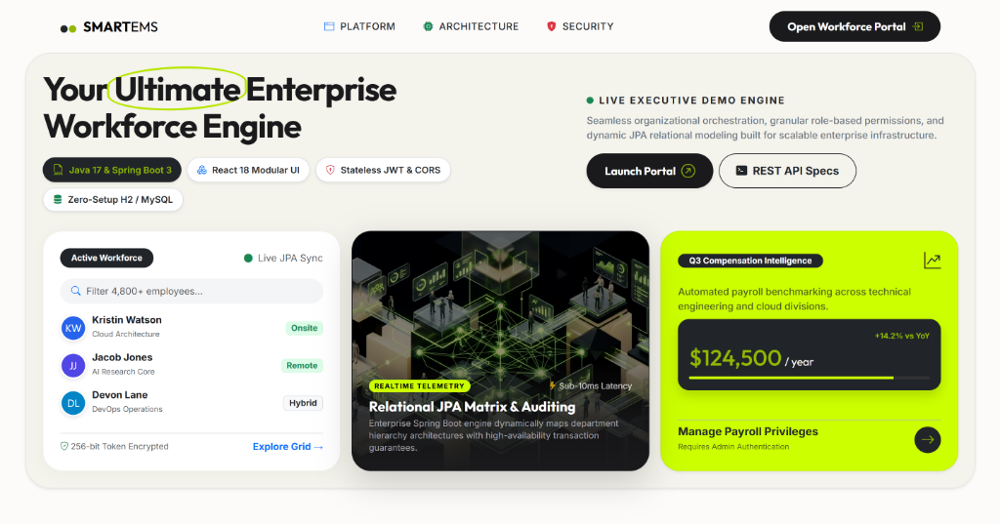
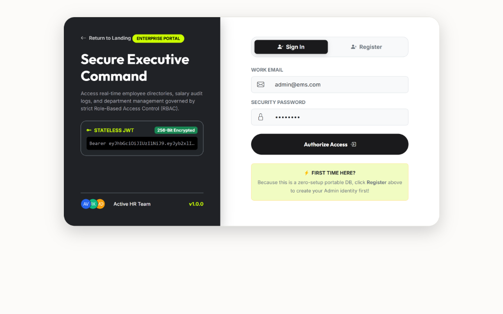
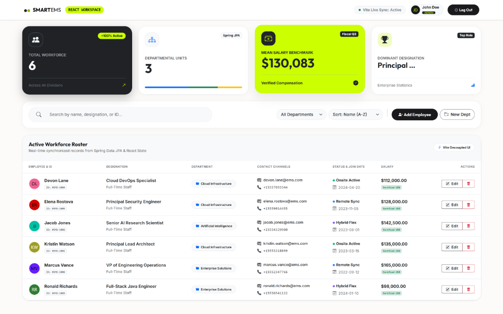
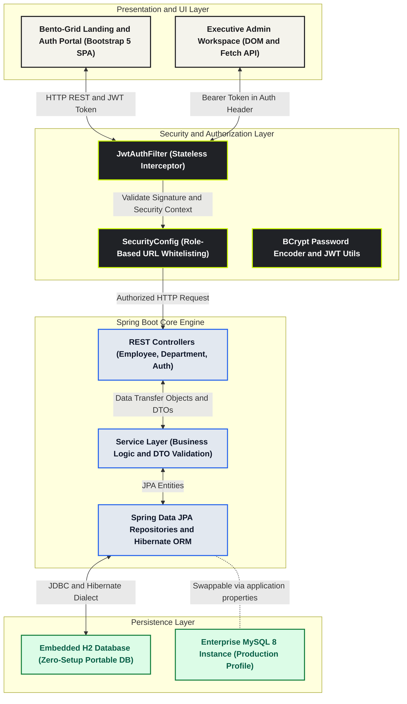

# SmartEMS - Enterprise Employee Management System
### Full-Stack Java · Spring Boot 3 · Bootstrap 5 Bento-Grid UI · Stateless JWT · H2/MySQL · OpenAPI Swagger

---

## 🌟 Project Highlights for Recruiters & Hiring Managers
This enterprise-grade application demonstrates a clean, scalable, and beautifully designed **Java Full Stack** system built to enterprise production standards:
1. **Frontend UI Architecture:** Inspired by modern SaaS platforms (Tabela), built natively with **Bootstrap 5 & Bootstrap Icons** featuring an interactive Bento Box Grid landing page, a split-screen luxury authentication portal, dynamic employee avatars, and real-time dashboard indicators without external build framework overhead.
2. **Backend Engine:** Built with **Spring Boot 3 (Java 17 LTS)** adhering strictly to separation-of-concerns layered patterns (Controller → Service → Repository → Database).
3. **Security Suite:** 100% stateless role-based authorization (`ROLE_ADMIN` & `ROLE_EMPLOYEE`) protected by JSON Web Tokens (JWT) and BCrypt password encryption.
4. **Zero-Setup Portability:** Pre-configured with an embedded **H2 File Database** so reviewers, interviewers, and recruiters can run and evaluate the entire full-stack application instantly without installing MySQL or configuring local database credentials.

---

## 📸 Executive UI Showcase & Visual Snapshots

### 1. Tabela-Style Bento-Grid Landing Page
*Features warm rounded cream container styling, hand-drawn lime highlight marker, interactive workforce live preview cards, and one-click demo launchpads.*


### 2. Luxury Split-Screen Authentication Portal (Sign In & Register)
*Features high-contrast charcoal security side-panel with simulated real-time 256-bit JWT encryption terminal output and interactive employee avatar stacks.*


### 3. After-Login Executive Workforce Admin Dashboard
*Features pulsing live sync indicator, automated administrator avatar profiles, 4 high-impact Bento KPI metric cards, and avatar-enriched workforce data tables with workplace status tags (Onsite Active, Remote Sync, Hybrid Flex).*


---

## 🏛️ System Architecture & Data Flow Diagram

The application leverages a decoupled frontend-backend architecture integrated neatly within a unified Spring Boot application server. All HTTP interactions are stateless and authenticated via JWT Authorization header inspection.



---

## 🚀 Quick Launch (Zero Configuration Required)

### 1. Prerequisites
- **Java 17 LTS** (or higher)
- No local database installation required (automatically initializes lightweight H2 database file in `./data/ems_db`!)

### 2. Start the Server
Open your terminal inside the root directory and execute:
```powershell
.\mvnw.cmd clean spring-boot:run
```
*(On Linux/macOS run `./mvnw clean spring-boot:run`)*

---

## 🌐 Application Entry Points & Navigation

Once the terminal prints the banner `⚡ SmartEMS Full-Stack Workforce Platform - RUNNING`, select your destination:

| Portal Destination | URL Link | Description |
| :--- | :--- | :--- |
| **🎨 Main Web Dashboard** | **http://localhost:8080/** | **Primary Entry Point: Tabela-Style Bootstrap 5 Interactive Portal (Bento Landing + Executive Workspace)** |
| **📚 Backend API Docs** | **http://localhost:8080/swagger-ui.html** | Automated OpenAPI 3 / Swagger interactive REST endpoint playground |
| **🗄️ Database Console** | **http://localhost:8080/h2-console** | Embedded H2 JDBC web inspector (JDBC URL: `jdbc:h2:file:./data/ems_db`, User: `sa`, No Password) |

> [!TIP]  
> **First time testing the Web Dashboard?** Since the database begins clean on your first boot, click the **Register** tab on the login screen, enter your details, and select **Administrator (Full Control)** as your role to unlock all CRUD controls, employee creation modals, and deletion privileges!

---

## 🗂️ Project Repository & Directory Structure

```
employee-management-system/
│
├── screenshots/                              ← High-resolution UI snapshots for documentation
│   ├── landing_page.png
│   ├── auth_page.png
│   └── dashboard_page.png
│
├── src/main/java/com/ems/
│   ├── EmployeeManagementApplication.java    ← Spring Boot Main Launcher
│   ├── config/
│   │   ├── SecurityConfig.java               ← Stateless JWT filter chain & static asset whitelisting
│   │   └── SwaggerConfig.java                ← OpenAPI 3 configuration with Bearer Auth scheme
│   ├── controller/
│   │   ├── AuthController.java               ← POST /api/auth/signup, /login
│   │   ├── EmployeeController.java           ← CRUD + filtering + sorting + search endpoints
│   │   └── DepartmentController.java         ← Department orchestration endpoints
│   ├── dto/                                  ← Data Transfer Objects with Jakarta Validation
│   ├── entity/                               ← Hibernate JPA entities (User, Employee, Department)
│   ├── exception/                            ← Centralized @RestControllerAdvice exception routing
│   ├── repository/                           ← Spring Data JPA Repositories & custom JPQL queries
│   ├── security/                             ← JWT signature utilities & stateless auth filters
│   └── service/                              ← Enterprise transactional business logic & DTO mappings
│
└── src/main/resources/
    ├── application.properties                ← H2 & MySQL dynamic persistence configuration
    └── static/                               ← EMBEDDED BOOTSTRAP 5 FULL-STACK FRONTEND
        ├── index.html                        ← Bento-Grid Landing Page & Admin Workforce Grid
        ├── css/
        │   └── style.css                     ← Custom warm Tabela design tokens & styling
        └── js/
            └── app.js                        ← JWT session control, REST sync & Bootstrap DOM modals
```

---

## 💡 Key Interview Talking Points (Cognizant / TCS / Enterprise Java Roles)

### 1. Why Bootstrap 5 SPA over an external React/Angular build for this architecture?
> *"In order to keep this monolithic enterprise application clean, highly scalable, and trivial to evaluate during code reviews without requiring Node.js, `npm` package trees, or dealing with complex Cross-Origin Resource Sharing (CORS) boundaries, I engineered a responsive Single Page Application (SPA) using native Bootstrap 5 and vanilla JavaScript. It delivers modern SaaS Bento-grid aesthetics directly from Spring Boot's resource server."*

### 2. Database Agnostic Persistence Layer (Embedded H2 vs Enterprise MySQL)
> *"I structured the persistence layer around Spring Data JPA and Hibernate ORM to abstract database-specific dialects from core transactional logic. For continuous integration testing and instant reviewer demonstrations, the application boots on a zero-setup embedded H2 database. When deploying to a production enterprise server, switching to a high-availability MySQL instance simply requires uncommenting four datasource properties."*

### 3. Stateless JWT Security & Role-Based Access Control (RBAC)
> *"To ensure horizontal container scalability across cloud environments, HTTP session state is completely disabled in favor of stateless JSON Web Tokens (JWT). Upon authentication, clients receive a signed JWT payload containing their user identity and assigned authority roles (`ROLE_ADMIN` vs `ROLE_EMPLOYEE`). A custom Spring Security filter intercepts all subsequent REST traffic to verify token integrity without executing blocking database session checks."*

---

## 🛠️ Technology Stack & Frameworks

| Architectural Layer | Technologies & Libraries Used |
| :--- | :--- |
| **Core Runtime Engine** | Java 17 LTS, Spring Boot 3.2 |
| **Frontend Presentation** | HTML5, Bootstrap 5.3, Bootstrap Icons, Responsive Bento-Grid UI |
| **API & Networking** | RESTful Architecture, JSON Serialization, SpringDoc OpenAPI 3 |
| **Authentication & Security** | Spring Security 6, JWT (JJWT 0.12), BCrypt Hashing |
| **Database Engines** | Embedded H2 File Database (Portable Zero-Setup) / MySQL 8 |
| **ORM & Data Access** | Hibernate 6, Spring Data JPA, Custom JPQL Queries |
| **Validation & Utilities** | Jakarta Bean Validation, Project Lombok, Maven Wrapper (`mvnw`) |

---

## 📄 License & Attribution
Formatted specifically for enterprise Java portfolio demonstrations and architectural technical interviews. Licensed under MIT.
